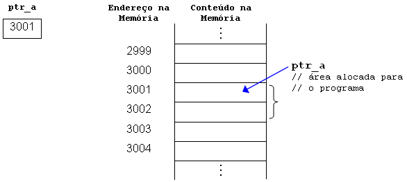

# Ponteiros

## Resumo

**Sintaxe:**
- Declaração de ponteiro: `int *ptr;`
- Atribuição de endereço a um ponteiro: `ptr = &variavel;`
- Acesso ao valor apontado por um ponteiro: `*ptr;`
- Aritmética de ponteiros: `ptr + 1;`
- Utilidade do "->" em ponteiros: Permite acessar membros de uma struct através de um ponteiro.
- Aritmética de ponteiros: `ptr + 1;`

 

**Utilidades:**
- Manipulação eficiente de memória
- Passagem de parâmetros por referência
- Alocação dinâmica de memória
  
 

**Livros Recomendados:**

1. "C Programming Language" by Brian W. Kernighan and Dennis M. Ritchie

2. "Understanding and Using C Pointers" by Richard Reese

 

**Leituras recomendáveis:**

[Ponteiros Brutos - C++](https://learn.microsoft.com/pt-br/cpp/cpp/raw-pointers?view=msvc-170)

[Ponteiros - PUCRS](https://www.inf.pucrs.br/~pinho/PRGSWB/Ponteiros/ponteiros.html#Alocacao_Dinamica_de_Memoria)